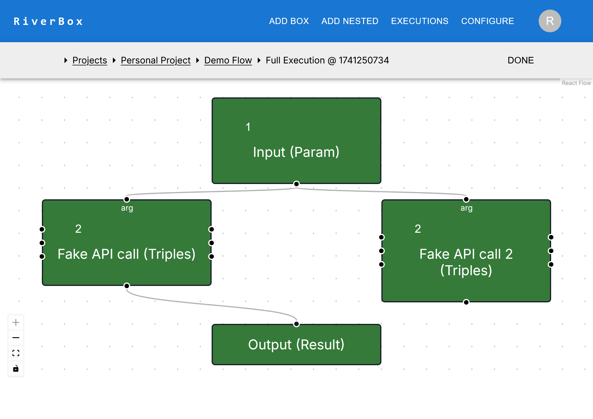

# Execute the Sample Notebook

This is a basic tutorial to walk you through the steps to go from logging in to executing a riverbox notebook

## Login
- From the landing page of the website, login.
- This could be an OAuth or username-password style credentials.
- Check with the admin of the web portal to login.

## All Projects Page
- You should see a projects page as such, with one project called the "Personal Project"
- Select this Personal Project (click on it)

## Project Page
- If you select the project, you should see a page as such, with a single "Demo Riverbox" and an empty filesystem
- Select this Riverbox (click on it)

## Riverbox Page
- If you selected the Demo riverbox, you should see a riverbox page that looks like this

- Here, you can click execute on the top bar, and from the drop-down select Run All to execute all cells (boxes) of this Notebook
- To do a Jupyter Notebook style execution, you can also select "Debug Mode"

## Execution Page
- The execution page will show the cells with an execution counter on the top
- On the second navbar, there should be a status indicator on the status of the execution
- The execution should start with maybe a slight delay, and boxes should turn green (successful, complete execution) and yellow (in progress)
- After the execution is completely finished, your screen should look something like this

