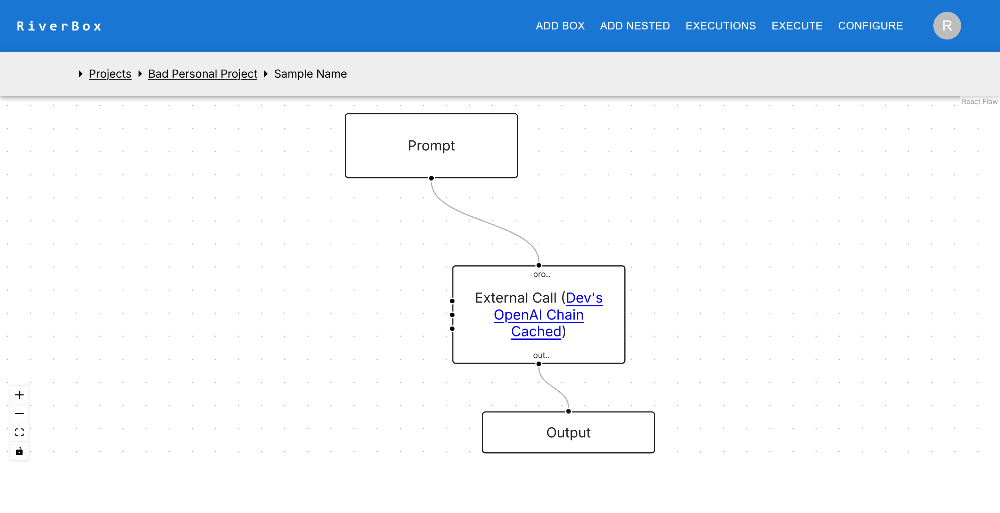

# Use an External Call in a Notebook

This is a basic tutorial to walk you through the steps to go from logging in to executing a riverbox notebook by calling an external call to a pre-made notebook

This is a whole separate project, with its own filesystem. It has a paper about "Delayed Fair Sharing" you can ask about on its filesystem (RAG).

Note that the "vLLM" riverbox runs a "base model", so answers may not be what you expect from "instruction tuned" models. 

## Login
- From the landing page of the website, login.
- This could be an OAuth or username-password style credentials.
- Check with the admin of the web portal to login.

## All Projects Page
- You should see a projects page as such, with one project called the "Personal Project"
- Select this Personal Project (click on it)

## Project Page
- If you select the project, you should see a page as such, with a single "Demo Riverbox" and an empty filesystem
- Make a new empty riverbox here, by clicking the NEW button

## New Riverbox
- You should see a form that looks as such
- You should only need to enter a name here, and click save, or press ctrl + s

Once you do this, you should see an empty Riverbox page that looks like this

## External Call
- Now it is time to add the box that calls into my external riverbox
- Make a "NEW NESTED" box, and search for "Dev's" in the search bar. You should see two options, a OpenAI one and a vLLM one. 
    - You can pick either one, or both in parallel!

- You can now add an input box, with a "Default Value" of the prompt (s) you want to test out, a long with (optionally) an output box
    - Alternatively, you can add a new code box, and have a single line `rbxm.output = "{whatever you want the prompt to be as a python string}"`
- Your riverbox should look something like this:

## Execute
- Now you can execute the riverbox
- You can execute all cells, or run it in "Notebook mode" for arbitrary cell order execution, like a computational Notebook
    - If you run in Notebook mode, remember to kill the execution when you are done
- Here is what the execution should look like

